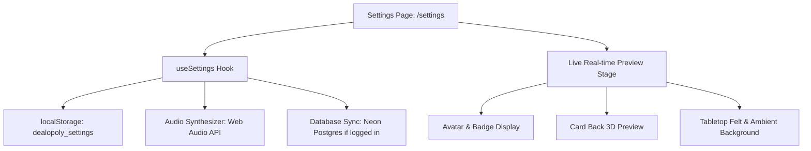

# Implementation Plan: Dealopoly Settings Page (`/settings`)

Build a dedicated, responsive **Settings Page** for Dealopoly that allows players to customize their profile identity, gameplay mechanics, audio & sound FX, tabletop visual themes, card backs, and system preferences with live previews and persistent local/database synchronization.

---

## Key Highlights & Requirements

- **Guest & Authenticated Support**: Settings will be saved immediately to `localStorage` (`dealopoly_settings`) so guests can customize their experience with zero barriers. When signed in, profile-related fields (name, custom tag) will also synchronize with the database.
- **Zero-Asset Web Audio Synthesizer**: Sound effects (card swoosh, chip click, victory chime, error thud) will be generated natively via the Web Audio API without requiring any heavy external audio file downloads.
- **Live Real-Time Preview**: The settings page will feature a dynamic preview banner at the top showing the user's customized avatar, selected tabletop felt theme, and chosen card back design updating live as options are toggled.

---

## Architecture & Data Flow



### Settings Data Schema (`DealopolySettings`)

```typescript
export interface DealopolySettings {
  // 1. Profile & Identity
  playerName: string;
  customTag: string;
  avatarId: "default" | "tycoon" | "banker" | "shark" | "shuffler";
  
  // 2. Gameplay & Table
  defaultGame: "arcade" | "monodeal" | "lowdeck";
  defaultBotDifficulty: "easy" | "medium" | "hard" | "expert";
  cardSortMode: "color" | "value" | "type" | "none";
  confirmPlayAction: boolean;
  autoPassTimer: boolean;
  
  // 3. Audio & Haptics
  masterMute: boolean;
  sfxVolume: number;        // 0 - 100
  ambienceVolume: number;   // 0 - 100
  hapticFeedback: boolean;
  
  // 4. Themes & Visuals
  tableTheme: "dark" | "casino" | "navy" | "arcade";
  cardBackDesign: "classic" | "gold" | "carbon";
  animationSpeed: "cinematic" | "snappy" | "reduced";
  
  // 5. Multiplayer & Privacy
  defaultRoomPrivate: boolean;
  allowSpectators: boolean;
  showReactions: boolean;
}
```

---

## Proposed Changes

### 1. Settings State & Audio Infrastructure

#### [NEW] `apps/web/src/lib/settings.ts`
- Provides the default settings object (`DEFAULT_SETTINGS`).
- Manages reading/writing to `localStorage` (`dealopoly_settings`).
- Dispatches custom storage events so components across open tabs or subtrees reactively re-render when settings change.

#### [NEW] `apps/web/src/lib/use-settings.ts`
- React hook `useSettings()` that provides:
  - `settings`: current settings object
  - `updateSetting<K>(key: K, value: DealopolySettings[K])`: partial updates
  - `resetSettings()`: resets all settings to defaults
  - `isLoaded`: whether client storage has rehydrated

#### [NEW] `apps/web/src/lib/sound-effects.ts`
- Pure Web Audio API sound synthesizer with zero external assets:
  - `playCardSwoosh(volume)`: airy whoosh when dealing cards
  - `playCardSlam(volume)`: punchy wood/felt thud when playing a card
  - `playCoinChime(volume)`: sparkling metallic chime when banking money or charging rent
  - `playVictoryFanfare(volume)`: celebratory arpeggio on win
  - `playToggleClick(volume)`: tactile click for UI switches
- Honors `masterMute` and `sfxVolume`.

---

### 2. Settings UI Components

#### [NEW] `apps/web/src/app/settings/page.tsx`
The primary page containing:
1. **Marketing Navigation Bar** with `activeTab="settings"`.
2. **Live Table & Card Preview Stage**:
   - Live rendered avatar & player tag.
   - Interactive 3D `<CardBack />` showing the selected style (`classic`, `gold`, or `carbon`).
   - Selected table felt backdrop with authentic table gloss.
3. **Category Tabs (Desktop Sidebar / Mobile Sticky Header)**:
   - 👤 Profile & Identity
   - 🎴 Gameplay & Rules
   - 🔊 Audio & Feedback
   - 🎨 Themes & Card Backs
   - 🌐 Multiplayer & Privacy
   - ⚙️ System & Diagnostics
4. **Interactive Controls**:
   - Sliders with numeric badges (SFX & Ambience volume with a "🔊 Test SFX" button).
   - Card selection grid for Avatars, Card Backs, and Tabletop Felts.
   - Pill selectors for Game Modes, Bot Difficulty, and Animation Speeds.
   - Switch toggles for Mute, Confirm Play, Auto-Pass, Haptics, and Reactions.
5. **System & Storage Actions**:
   - Cache counters: Room sessions count, recent rooms count.
   - "Clear Session Cache" and "Reset to Factory Defaults" buttons.
   - WebSocket Game Server connectivity status badge.

---

### 3. Navigation & App Integration

#### [MODIFY] `apps/web/src/app/_components/marketing-nav.tsx`
- Link the top navigation settings gear icon to `/settings` instead of `/profile`.
- Add `"settings"` to `activeTab` prop type.

#### [MODIFY] `apps/web/src/app/_components/user-nav.tsx`
- Add a **Settings** option in the user profile avatar dropdown menu linking to `/settings`.

#### [MODIFY] `apps/web/src/app/profile/page.tsx`
- Add a **"Game Settings ⚙️"** action button alongside the existing "Play Now" button to allow quick cross-navigation between Profile Stats and Settings.

#### [MODIFY] `apps/web/src/app/globals.css`
- Add modern, accessible styling for the settings layout, responsive sidebar/tabs, custom range sliders, toggle switches, and card-back preview containers.

---

## Phased Execution Strategy

1. **Step 1: Core Settings Hook & Audio Synthesizer**
   - Create `apps/web/src/lib/settings.ts`, `apps/web/src/lib/use-settings.ts`, and `apps/web/src/lib/sound-effects.ts`.
2. **Step 2: Settings Page Framework & Live Preview Stage**
   - Build `/settings` page scaffolding with hero preview and tab navigation.
3. **Step 3: Section Controls Implementation**
   - Implement Profile, Gameplay, Audio, Themes, Privacy, and System tabs with live feedback.
4. **Step 4: Global Nav Hookup & Testing**
   - Connect settings links across `marketing-nav.tsx`, `user-nav.tsx`, and `profile/page.tsx`.
   - Run typecheck and unit tests to verify zero regressions.

---

## Verification Plan

### Automated Verification
- `pnpm --filter @dealopoly/web typecheck`: Ensure 100% strict TypeScript compliance.
- `pnpm test`: Ensure all existing unit tests pass without regressions.

### Manual Verification
1. Navigate to `http://localhost:3000/settings`.
2. Test Profile: Edit name and tag; verify immediate preview update and persistence across reloads.
3. Test Themes: Change table felt and card back; verify live 3D preview updates instantly.
4. Test Audio: Adjust SFX volume, click "Test SFX", and verify synthesized sound plays. Test master mute toggle.
5. Test Storage: Click "Clear Session Cache" and verify cache counts reset. Click "Reset Defaults" and verify all settings reset cleanly.
6. Test Mobile: Verify responsive layout on mobile viewport (sticky category pill bar, touch-friendly tap targets).
